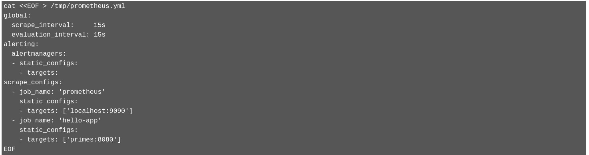

# Install Prometheus

## Create Prometheus Configuration

Next, let’s install Prometheus. Prometheus is an open-source systems monitoring and alerting toolkit featuring:

a multi-dimensional [data model](https://prometheus.io/docs/concepts/data_model/) with time series data identified by metric name and key/value pairs

[PromQL](https://prometheus.io/docs/prometheus/latest/querying/basics/), a flexible query language to leverage this dimensionality

time series collection happens via a pull model over HTTP

* To install it, first create a Kubernetes ConfigMap that will hold the Prometheus configuration. Click on the following command to create this file:



  * To configure correctly see [Configuring Prometheus metrics monitoring for Process Server on Red Hat OpenShift Container Platform](https://access.redhat.com/documentation/en-us/red_hat_process_automation_manager/7.6/html-single/managing_and_monitoring_process_server/index#prometheus-monitoring-ocp-proc_execution-server). Note: We have opted to not install prometheus operator and so don't use Service & ServiceMonitor per documentation
   * USING PROMETHEUS OPERATOR & Service & ServiceMonitor to expose RHPAM metrics
```bash
cat <<EOF > prometheus.yml
global:
  scrape_interval:     15s
  evaluation_interval: 15s
alerting:
  alertmanagers:
  - static_configs:
    - targets:
scrape_configs:
  - job_name: 'prometheus'
    static_configs:
    - targets: ['localhost:9090']
  - job_name: 'enable-prometheus-kieserver'
    basic_auth:
      username: adminUser
      password: RedHat
    static_configs:
    - targets: ['rhpam-app-metrics:8080']
EOF
```
   * (*USED HERE*) USING Non-Operator based prometheus & directly scrping from KIE Servers
```bash
global:
  scrape_interval:     15s
  evaluation_interval: 15s
alerting:
  alertmanagers:
  - static_configs:
    - targets:
scrape_configs:
  - job_name: 'prometheus'
    static_configs:
    - targets: ['localhost:9090']
  - job_name: 'enable-prometheus-kieserver'
    metrics_path: /services/rest/metrics
    basic_auth:
      username: adminUser
      password: RedHat
    static_configs:
    - targets: ['enable-prometheus-kieserver:8080']
```


This file contains basic Prometheus configuration, plus a specific scrape_configwhich instructs Prometheus to look for application metrics from both Prometheus itself, and a Quarkus app called primes which we'll create later, on HTTP port 8080 at the /metrics endpoint.

* Next, click this command to *create a ConfigMap* with the above file:

```bash
oc create configmap prom --from-file=prometheus.yml=.prometheus.yml
```

* *Deploy Prometheus*. Next, deploy and expose Prometheus using its public Docker Hub image:

```bash
oc new-app prom/prometheus && oc expose svc/prometheus
```

* And finally, mount the ConfigMap into the running container:

```bash
oc set volume dc/prometheus --add -t configmap --configmap-name=prom -m /etc/prometheus/prometheus.yml --sub-path=prometheus.yml
```

This will cause the contents of the ConfigMap data to be mounted at /etc/prometheus/prometheus.yml inside its container where Prometheus is expecting it.

* Verify Prometheus is up and running:

```bash
oc rollout status -w dc/prometheus
```

You should see replication controller "prometheus-2" successfully rolled o


