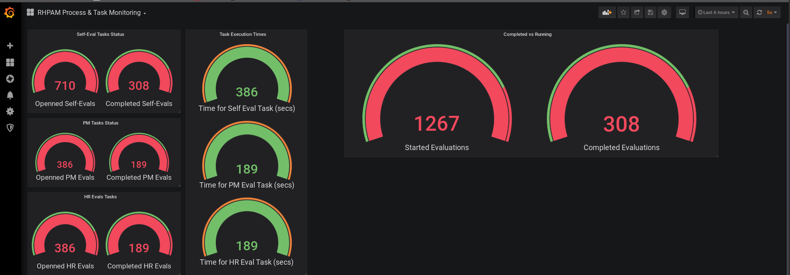

# Visualize & Monitor RH PAM Project Stats with Prometheus & Grafana


Inspired by documentation managing_and_monitoring_process_server https://access.redhat.com/documentation/en-us/red_hat_process_automation_manager/7.6/html-single/managing_and_monitoring_process_server/index#prometheus-monitoring-con_execution-server

* Inspired by [documentation managing_and_monitoring_process_server](https://access.redhat.com/documentation/en-us/red_hat_process_automation_manager/7.6/html-single/managing_and_monitoring_process_server/index#prometheus-monitoring-con_execution-server)
* Also locally in repo available in this repository [Red_Hat_Process_Automation_Manager-7.6-Managing_and_monitoring_Process_Server-en-US.pdf](.Red_Hat_Process_Automation_Manager-7.6-Managing_and_monitoring_Process_Server-en-US.pd)


## Setup PAM for DEv & Runtime

* Setup In OCP
** Operator based installation [documentation managing_and_monitoring_process_server](https://access.redhat.com/documentation/en-us/red_hat_process_automation_manager/7.6/html-single) (Ensure 'kieserver' POD has 
** non Operator based //github.com/jbossdemocentral/rhpam7-install-demo
 
* On Prem
** installer //github.com/jbossdemocentral/rhpam7-install-demo

* Import Evaluation_Process Business Project in BC 
*** Import Examples --> Evaluations
*** Update 'evaluations' Business Process all tasks to have as GROUP 'kie-server'
*** deploy on KIE Server

* Ensure the following property is configured (dependent on environment)


```bash
vim ./org.drools-droolsjbpm-integration-7.26.0.Final/kie-server-parent/kie-server-services/kie-server-services-prometheus/src/main/java/org/kie/server/services/prometheus

SPRINGBOOT
kieserver.prometheus.enabled=true (application.properties)

KIE Server
NON-OCP: org.kie.prometheus.server.ext.disabled=false 
OCP:         servers:
    - env:
      - name: PROMETHEUS_SERVER_EXT_DISABLED
        value: "false"
```


## Setup prometheus to monitor KIE Server(s)

see Install-Prometheus.md


## Setup monitoring with GRafana

### Install Grafana

oc new-app grafana/grafana && oc expose svc/grafana

Verify Grafana is up and running:

oc rollout status -w dc/grafana

You should see replication controller "grafana-1" successfully rolled out

Open Grafana Dashboard
Click on this link to open the Grafana Dashboard in your browser, and login using the default credentails:

Username: admin
Password: admin
Grafana UI
At the password change prompt, use any password you wish.

Add Prometheus as a data source
You’ll land on the Data Source screen. Click Add Data Source, and select Prometheus as the Data Source Type.

In the URL box, type http://prometheus:9090 (this is the hostname and port of our running Prometheus in our namespace):

Connect promethes with grafana (
- SVC (Not working) http://prometheus.dev-rhpam-operator.svc.cluster.local)
- ROUTE (Working) http://prometheus-dev-rhpam-operator.apps.cluster-instabul-9983.instabul-9983.example.opentlc.com


Grafana UI
Click Save and Test. You should see:

Grafana UI

### Create Dashboards

see How-To-Monitor.md
then see

├── ready-dashboards
│   ├── RHPAM-Evaluations-Process&Monitoring-GrafanaDashBoard-API-Based-Templete.json
│   └── RHPAM-Evaluations-Process&Monitoring-GrafanaDashBoard.json


### Create Traffic for the metrics




