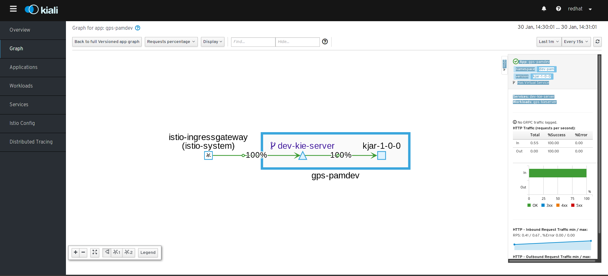
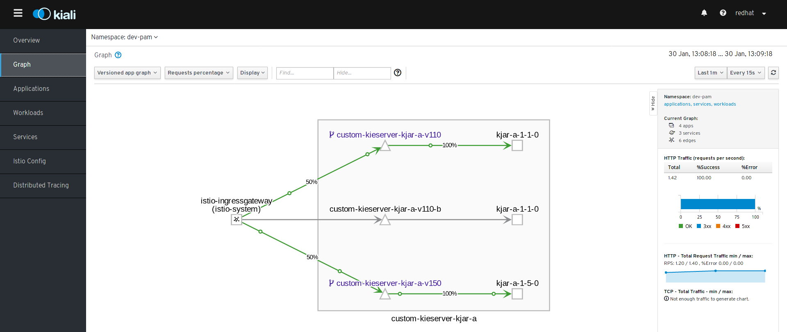
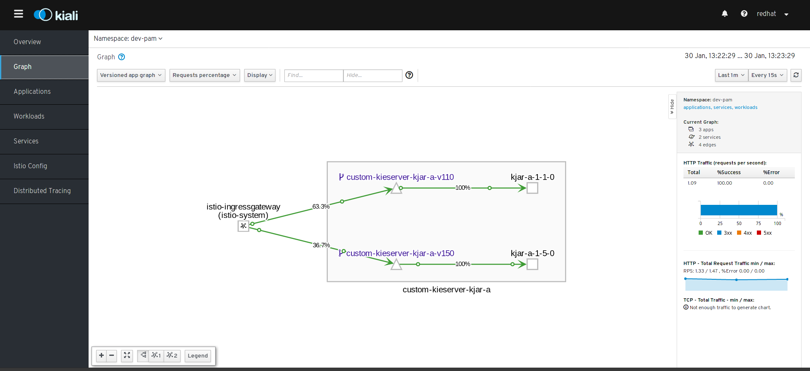
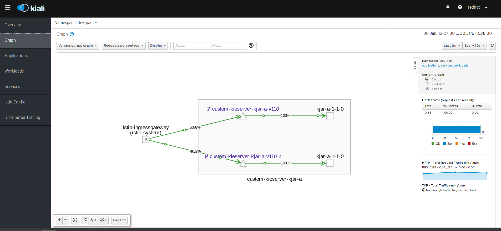
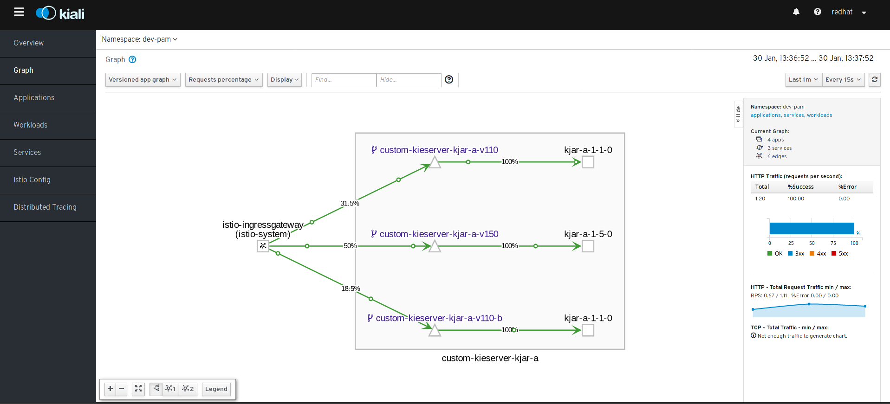
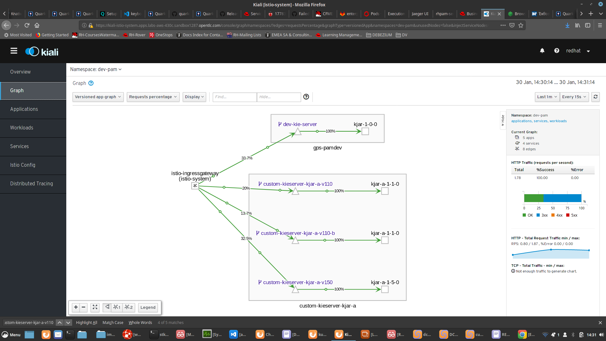

# How to Test RH-PAM & ISTIO (Ideas)

* Pre-reqs
  * ISTIO must be installed & available in OCP Cluster See [Documentation](https://access.redhat.com/documentation/en-us/openshift_container_platform/4.3/html-single/service_mesh/index#ossm-supported-configurations_preparing-ossm-installation)
  * Be able to set ServiceMeshMemberRoll to the namespace you will use for RHPAM Deployments accessible via ISTIO

* To Install ISTIO Read
  * OCP 4 Installation: https://gitlab.consulting.redhat.com/enterprise-integration-design-sprint/infra/ocp
  * ISTIO Installation: https://github.com/dsanchor/istio-tutorial
  * See also 'Labs - Openshift Service Mesh - Istio.odp' in this repository on adding ISTIO PRoxy side car

## Install a standard DEV Environment (BC + KIE Server)

* CICD Tools setup: https://github.com/erkerc/openshift-cd-demo.git
* See https://github.com/skoussou/ocp_pam_app_dev 
  * Use the tools above rather than this repo's tool setup
  * Configure the OCP CLuster from above URLs/DOmains to be used
  * eg. ./Infrastructure/scripts76/setup_DEV_managed.sh dev-pam cicd-rhpam gps apps.labs-aws-430a.sandbox452.opentlc.com nexu
* Test BC To KIE Server (via CICD Nexus <distributionManagement> from the KJAR project) installaton of Evaluations project
  * eg. 
```
 <distributionManagement>
   <repository>
     <id>Nexus</id>
     <url>http://nexus-cicd-rhpam.apps.labs-aws-430c.sandbox1287.opentlc.com/repository/maven-releases</url>
   </repository>
   <snapshotRepository>
     <id>Nexus</id>
     <url>http://nexus-cicd-rhpam.apps.labs-aws-430c.sandbox1287.opentlc.com/repository/maven-snapshots</url>
   </snapshotRepository>
 </distributionManagement>
```


## Configure Template Created DEV Environment with ISTIO

* Configure __dev-pam__ namespace in ServiceMeshMemberRoll
* Remove Routes for BC & KIE Server from __dev-pam_ namespace
* Create a new HTTP Service for BC and another for KIE Server to be used in the following ISTIO Configs (RHPAM-and-ServiceMesh/OPTION-0-gateway-destrules-kie-server.yam)

```
# used by OPTION-0 Template based kieserver
apiVersion: v1
kind: Service
metadata:
  name: dev-kie-server
  labels:
    app: gps-pamdev
    application: dev-kie-server
    group : istio-pam-tests
spec:
  ports:
    - name: http
      protocol: TCP
      port: 8080
      targetPort: 8080
  selector:
    deploymentConfig: gps-kieserver

# used by OPTION-0 Template based kieserver
apiVersion: v1
kind: Service
metadata:
  name: dev-bc
  labels:
    app: gps-pamdev
    application: dev-bc  
    group : istio-pam-tests
spec:
  ports:
    - name: http
      protocol: TCP
      port: 8080
      targetPort: 8080
  selector:
    deploymentConfig: gps-rhpamcentr
```

* Apply ISTIO Configs OPTION-0-gateway-destrules-kie-server.yaml
  * eg. cat ./RHPAM-and-ServiceMesh/OPTION-0-gateway-destrules-kie-server.yaml | APP_SUBDOMAIN=$(echo $SUBDOMAIN) NAMESPACE=$(echo $APPS_NAMESPACE) envsubst | oc apply -f - 
* Ensure __istio-proxy__ side car is added to DC for KIE Server & RHPAM 
```
eg.
oc patch dc/gps-kieserver -p '{"spec":{"template":{"metadata":{"annotations":{"sidecar.istio.io/inject":"true"}}}}}' -n $APPS_NAMESPACE
```
* Now for BC Route http://template-rhpam-bc-dev-pam-istio-system.apps.labs-aws-430c.sandbox1287.opentlc.com should work
  * Test by calling: 
```
watch -n1 "curl -v template-rhpam-bc-dev-pam-istio-system.apps.labs-aws-430c.sandbox1287.opentlc.com/"
```
* Now for KIE Server (from template) http://template-rhpam-service-dev-pam-istio-system.apps.labs-aws-430c.sandbox1287.opentlc.com/docs/ should be accessible 
  * Test by calling: 
```
watch -n1 "curl -v http://template-rhpam-service-dev-pam-istio-system.apps.labs-aws-430c.sandbox1287.opentlc.com/docs/"
```
* The ISTIO Configs in __dev-pam__ namespace
```
oc get gw
NAME                AGE
template-rhpam-gw   21h


$ oc get VirtualService
NAME                                GATEWAYS              HOSTS                                                                                      AGE
template-rhpam-bc-virtual-service   [template-rhpam-gw]   [template-rhpam-bc-dev-pam-istio-system.apps.labs-aws-430c.sandbox1287.opentlc.com]        21h
template-rhpam-virtual-service      [template-rhpam-gw]   [template-rhpam-service-dev-pam-istio-system.apps.labs-aws-430c.sandbox1287.opentlc.com]   21h

$ oc get DestinationRules
NAME                             HOST                             AGE
custom-kieserver-kjar-a-v110     custom-kieserver-kjar-a-v110     19h
custom-kieserver-kjar-a-v110-b   custom-kieserver-kjar-a-v110-b   50m
custom-kieserver-kjar-a-v150     custom-kieserver-kjar-a-v150     19h
dev-kie-server                   dev-kie-server                   21h

$ oc get routes -n istio-system
NAME                                HOST/PORT                                                                                PATH      SERVICES               PORT      TERMINATION   WILDCARD
istio-ingressgateway                istio-ingressgateway-istio-system.apps.labs-aws-430c.sandbox1287.opentlc.com                       istio-ingressgateway   8080                    None
template-bc-ingressgateway          template-rhpam-bc-dev-pam-istio-system.apps.labs-aws-430c.sandbox1287.opentlc.com                  istio-ingressgateway   http2                   None
template-kieserver-ingressgateway   template-rhpam-service-dev-pam-istio-system.apps.labs-aws-430c.sandbox1287.opentlc.com             istio-ingressgateway   http2                   None
```
* Below image showcaces KIALI's visualization on how the DEV KIE Server serving requests  for KJAR-A-1-0-0 via a sing K8s/ISTIO Service (dev-kie-server)



## Setup KIE Server/KJARs with multiple versions

* Note: ImageStreams should come from 'openshift' namespace, secrets/settigs.xml should be available for KIE Server in namespace based on previous template config
* Create 2 new PVCs required by the KIE Servers in  __dev-pam__ 
```
  * oc create -f ./RHPAM-and-ServiceMesh/PVC-V110-.yaml
  * oc create -f ./RHPAM-and-ServiceMesh/PVC-V150-.yaml
```
* Create the necessary services for the 2 new KIE Servers to be used by ISTIO Config (see: [./RHPAM-and-ServiceMesh/Service.yaml](./RHPAM-and-ServiceMesh/Service.yaml) pointing to Option 3)
* Apply ISTIO Configs [OPTION-3-ADVANCED-gateway-destrules-kie-server.yaml](./RHPAM-and-ServiceMesh/Service.yaml/OPTION-3-ADVANCED-gateway-destrules-kie-server.yaml)
```
  cat ./RHPAM-and-ServiceMesh/OPTION-3-ADVANCED-gateway-destrules-kie-server.yaml | APP_SUBDOMAIN=$(echo $SUBDOMAIN) NAMESPACE=$(echo $APPS_NAMESPACE) envsubst | oc apply -f - 
```
* Create KIE Servers
  * KIE Server kjar-a-1-1-0: APPLY DC-KIE-v110-2
  * KIE Server kjar-a-1-5-0: APPLY DC-KIE-v150-2
* Access KIE Servers for kjar-a-1-1-0 & kjar-a-1-5-0 at: http://rhpam-service-a-${APPS_NAMESPACE}-istio-system.${SUBDOMAIN}/docs"
  * Check KIALI UI: The requests (execute ./RHPAM-and-ServiceMesh/loop-pam-custom-kjar-a.sh) should be 80%-20% on each server based on VirtualService weights, play with the weights)
* The ISTIO Configs in __dev-pam__ namespace
```
oc get gw
NAME                AGE
rhpam-gw            19h


$ oc get VirtualService
NAME                                GATEWAYS              HOSTS                                                                                      AGE
rhpam-virtual-service               [rhpam-gw]            [rhpam-service-a-dev-pam-istio-system.apps.labs-aws-430c.sandbox1287.opentlc.com]          19h

$ oc get DestinationRules
NAME                             HOST                             AGE
custom-kieserver-kjar-a-v110     custom-kieserver-kjar-a-v110     19h
custom-kieserver-kjar-a-v150     custom-kieserver-kjar-a-v150     19h

$ oc get routes -n istio-system
NAME                                HOST/PORT                                                                                PATH      SERVICES               PORT      TERMINATION   WILDCARD
istio-ingressgateway                istio-ingressgateway-istio-system.apps.labs-aws-430c.sandbox1287.opentlc.com                       istio-ingressgateway   8080                    None
rhpam-service-a-ingressgateway      rhpam-service-a-dev-pam-istio-system.apps.labs-aws-430c.sandbox1287.opentlc.com                    istio-ingressgateway   http2                   None
```
  
### Setup KIE Server/KJARs with multiple (KJAR) versions (Use HTTP Header parameter)

* After the previous setup is in place apply new ISTIO Configs OPTION-3a-ADVANCED-gateway-destrules-kie-server-HEADER-BASED-ROUTING.yaml
```
   eg.  
   cat ./RHPAM-and-ServiceMesh/OPTION-3a-ADVANCED-gateway-destrules-kie-server-HEADER-BASED-ROUTING.yaml | APP_SUBDOMAIN=$(echo $SUBDOMAIN) NAMESPACE=$(echo $APPS_NAMESPACE) envsubst | oc apply -f - 
```
* Now rather than 80/20 the requests will go to service 'custom-kieserver-kjar-a-v110' when the request to Route http://rhpam-service-a-${APPS_NAMESPACE}-istio-system.${SUBDOMAIN}/docs contains also header 'bizversion: version-kjar-a-110'
```
  watch -n1 "curl -v -H 'bizversion: version-kjar-a-110'  http://rhpam-service-a-${APPS_NAMESPACE}-istio-system.${SUBDOMAIN}/docs
```
* without the header param requests will go to service 'custom-kieserver-kjar-a-v150'
```
  watch -n1 "curl -v http://rhpam-service-a-${APPS_NAMESPACE}-istio-system.${SUBDOMAIN}/docs
```
* This is the result of __Virtual Service__ *rhpam-virtual-service* checking for the header _bizversion_ and value __version-kjar-a-110__ and sending to __Service__ custom-kieserver-kjar-a-v110 via __DestinationRule__ custom-kieserver-kjar-a-v110
* Below image showcases KIALI's visualization on how a Business Service Request for KJAR-A-1-0-0 is served by 2 different K8s/ISTIO Services (custom-kieserver-kjar-a-v110, custom-kieserver-kjar-a-v150) at 50% each as we have equal requests with & without HEADER param __bizversion: version-kjar-a-110__

* And the same by stopping requests without the header reduces the % going to the custom-kieserver-kjar-a-v150 KIE Server


### Setup KIE Server/KJARs with multiple (KIE) Services for the same KJAR Version
* Using ./RHPAM-and-ServiceMesh/OPTION-3a-ADVANCED-gateway-destrules-kie-server-HEADER-BASED-ROUTING-WILDCARD.yaml (and appropriate __DC-KIE-110-2__, Service __custom-kieserver-kjar-a-v110-b__ from ./RHPAM-and-ServiceMesh/Service.yaml and __PVC-V110-b.yaml__ -storage- you expand the *KJAR-a-1-0-0* backend services and allow ISTIO to route to both at 50% rate
* Below image showcaces KIALI's visualization on how a Business Service Request for KJAR-A-1-0-0 is served by 2 different K8s/ISTIO Services (custom-kieserver-kjar-a-v110, custom-kieserver-kjar-a-v100-b)



### Setup KIE Server/KJARs with multiple (KJAR) versions & multiple (KIE) Services for the same KJAR Version
* With the ./RHPAM-and-ServiceMesh/OPTION-3a-ADVANCED-gateway-destrules-kie-server-HEADER-BASED-ROUTING-WILDCARD.yaml ISTIO config in place 
* Start again without the header param requests will go to service 'custom-kieserver-kjar-a-v150'
```
  watch -n1 "curl -v http://rhpam-service-a-${APPS_NAMESPACE}-istio-system.${SUBDOMAIN}/docs
```
* Below image showcaces KIALI's visualization on how a Business Service Request for KJAR-A-1-0-0 (via requests with 'bizversion: version-kjar-a-110') is served by 2 different K8s/ISTIO Services (custom-kieserver-kjar-a-v110, custom-kieserver-kjar-a-v100-b) and for KJAR-A-1-5-0 by 1 service (custom-kieserver-kjar-a-v150)

* The ISTIO Configs in __dev-pam__ namespace

```
oc get gw
NAME                AGE
rhpam-gw            19h
template-rhpam-gw   21h

$ oc get VirtualService
NAME                                GATEWAYS              HOSTS                                                                                      AGE
rhpam-virtual-service               [rhpam-gw]            [rhpam-service-a-dev-pam-istio-system.apps.labs-aws-430c.sandbox1287.opentlc.com]          19h
template-rhpam-bc-virtual-service   [template-rhpam-gw]   [template-rhpam-bc-dev-pam-istio-system.apps.labs-aws-430c.sandbox1287.opentlc.com]        21h
template-rhpam-virtual-service      [template-rhpam-gw]   [template-rhpam-service-dev-pam-istio-system.apps.labs-aws-430c.sandbox1287.opentlc.com]   21h

$ oc get DestinationRules
NAME                             HOST                             AGE
custom-kieserver-kjar-a-v110     custom-kieserver-kjar-a-v110     19h
custom-kieserver-kjar-a-v110-b   custom-kieserver-kjar-a-v110-b   50m
custom-kieserver-kjar-a-v150     custom-kieserver-kjar-a-v150     19h
dev-kie-server                   dev-kie-server                   21h

$ oc get routes -n istio-system
NAME                                HOST/PORT                                                                                PATH      SERVICES               PORT      TERMINATION   WILDCARD
istio-ingressgateway                istio-ingressgateway-istio-system.apps.labs-aws-430c.sandbox1287.opentlc.com                       istio-ingressgateway   8080                    None
rhpam-service-a-ingressgateway      rhpam-service-a-dev-pam-istio-system.apps.labs-aws-430c.sandbox1287.opentlc.com                    istio-ingressgateway   http2                   None
template-bc-ingressgateway          template-rhpam-bc-dev-pam-istio-system.apps.labs-aws-430c.sandbox1287.opentlc.com                  istio-ingressgateway   http2                   None
template-kieserver-ingressgateway   template-rhpam-service-dev-pam-istio-system.apps.labs-aws-430c.sandbox1287.opentlc.com             istio-ingressgateway   http2                   None

```

* Below image showcaces KIALI's visualization on all above configs together


### Configuring KIEContainers in ISTIO configured KIE Servers

* WATCH POD LOGs for the following commands/tests
```
oc logs -f custom-kieserver-kjar-a-v110-2-ntv6j -c custom-kieserver-kjar-a-v110
oc logs -f custom-kieserver-kjar-a-v110-b-1-ks64l -c custom-kieserver-kjar-a-v110-b
```
* Configuring a KIE Container to the correct KIE Server by Label Version
  * PUT KIEContainer to POD LABEL __version : kjar-a-1-1-0__
```
curl -X PUT -H 'bizversion: version-kjar-a-110' "http://rhpam-service-a-dev-pam-istio-system.apps.labs-aws-430c.sandbox1287.opentlc.com/services/rest/server/containers/evaluation" -H  "accept: application/json" -H  "content-type: application/json" -d "{    \"container-id\" : \"evaluation\",    \"release-id\" : {        \"group-id\" : \"evaluation\",        \"artifact-id\" : \"evaluation\",        \"version\" : \"1.1.0\"    }}"
{
  "type" : "SUCCESS",
  "msg" : "Container evaluation successfully deployed with module evaluation:evaluation:1.1.0.",
  "result" : {
    "kie-container" : {
      "container-id" : "evaluation",
      "release-id" : {
        "group-id" : "evaluation",
        "artifact-id" : "evaluation",
        "version" : "1.1.0"
      },
      "resolved-release-id" : {
        "group-id" : "evaluation",
        "artifact-id" : "evaluation",
        "version" : "1.1.0"
      },
      "status" : "STARTED",
      "scanner" : {
        "status" : "DISPOSED",
        "poll-interval" : null
      },
      "config-items" : [ ],
      "messages" : [ {
        "severity" : "INFO",
        "timestamp" : {
  "java.util.Date" : 1580392689915
},
        "content" : [ "Container evaluation successfully created with module evaluation:evaluation:1.1.0." ]
      } ],
      "container-alias" : null
    }
  }
}
```
  * GET KIEContainer from POD with LABEL __version : kjar-a-1-1-0__
```
curl -X -H 'bizversion: version-kjar-a-110'  GET "http://rhpam-service-a-dev-pam-istio-system.apps.labs-aws-430c.sandbox1287.opentlc.com/services/rest/server/containers" -H  "accept: application/json"
```
  * REMOVE KIEContainer from POD with LABEL __version : kjar-a-1-1-0__
```
curl -X DELETE -H 'bizversion: version-kjar-a-110' "http://rhpam-service-a-dev-pam-istio-system.apps.labs-aws-430c.sandbox1287.opentlc.com/services/rest/server/containers/evaluation" -H  "accept: application/json"
```
  * START A PROCESS INSTANCE in one of the KIE Servers with LABEL __version : kjar-a-1-1-0__
```
$ curl -u 'executionUser:executionUser123' -X POST -H 'bizversion: version-kjar-a-110' "http://rhpam-service-a-dev-pam-istio-system.apps.labs-aws-430c.sandbox1287.opentlc.com/services/rest/server/containers/evaluation/processes/evaluation/instances" -H  "accept: application/json" -H  "content-type: application/json" -d "{}"
1

# ABOVE WENT TO POD custom-kieserver-kjar-a-v110-b

[stkousso@stkousso RHPAM-and-ServiceMesh]$ curl -u 'executionUser:executionUser123' -X POST -H 'bizversion: version-kjar-a-110' "http://rhpam-service-a-dev-pam-istio-system.apps.labs-aws-430c.sandbox1287.opentl.com/services/rest/server/containers/evaluation/processes/evaluation/instances" -H  "accept: application/json" -H  "content-type: application/json" -d "{}"
2

# ABOVE WENT TO POD custom-kieserver-kjar-a-v110-b

[stkousso@stkousso RHPAM-and-ServiceMesh]$ curl -u 'executionUser:executionUser123' -X POST -H 'bizversion: version-kjar-a-110' "http://rhpam-service-a-dev-pam-istio-system.apps.labs-aws-430c.sandbox1287.opentl.com/services/rest/server/containers/evaluation/processes/evaluation/instances" -H  "accept: application/json" -H  "content-type: application/json" -d "{}"

# ABOVE WENT TO POD custom-kieserver-kjar-a-v110 (because using H2 in memory DB different Instance Version)

```

### Possible Smart Routing with ISTIO

* We could create a *Smart Router* (Routing) effect with ISTIO
  * ALIAS BASED Route/VirtualService for all versions of a specific KJAR service  (ie. one host)  eg. http://rhpam-service-a-${APPS_NAMESPACE}-istio-system.${SUBDOMAIN} (where -a- is the KJAR/ALIAS name)
  * VirtualService which separates requests based on LABEL to a "subset" of KIE Servers 
```
apiVersion: networking.istio.io/v1alpha3
kind: VirtualService
metadata:
  name: rhpam-virtual-service
  namespace: ${NAMESPACE}
  labels:
    group: tutorial
spec:
  gateways:
  - rhpam-gw
  hosts:
  - rhpam-service-a-${NAMESPACE}-istio-system.${APP_SUBDOMAIN}
  http:
  - match:
    - headers:
        bizversion:
          exact: version-kjar-a-110
    route:
    - destination:
        host: custom-kieserver-kjar-a-v110
        subset: version-kjar-a-110
      weight: 50
    - destination:
        host: custom-kieserver-kjar-a-v110-b
        subset: version-kjar-a-110
      weight: 50
  - route:
    - destination:
        host: custom-kieserver-kjar-a-v150
        subset: version-kjar-a-150
```
  * Loadbalancing against KIE Servers with the same Label Version -whilst keeping an ALIAS based ROUTE- would result in transparrent KJAR usage (so long as client knows/can select based on previous request/client configuration the LABEL Version used in that request)
  * New requests, or requests which would not require version specific activities would go to the LATEST version (ie. updaes of the VirtualService and new DestinationRule would be require based on current config)


### Possible Smart Routing with ISTIO
* *Problems* unresolved or not tested for now
  * HOW agreggation of queries like Smart Router would do against ALL KIE Servers if they are not backed by the same DB
  * HOW multi version KIE Servers (ie. multiple versions of the same Business Logic/KJAR or even different KJARs with different versions to be catered by ISTIO routing)
  * containerId/Alias on URL to be combined with Label when doing specific wotk on Process/Task Instance
    * Seeing tests on creating processes it looks possible so long as LABEL version is known and common DB is used


