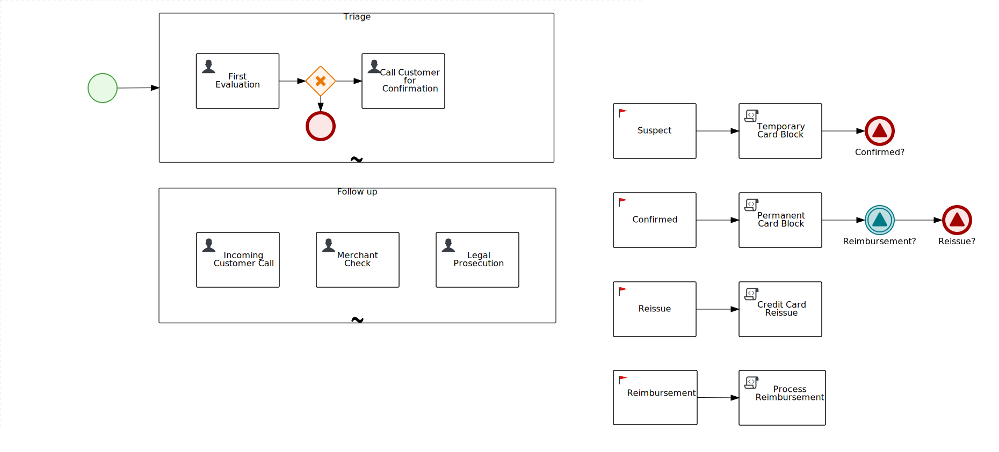

Proactive Fraud Detection Case Management Demo
==============================================

Demo of the case management capabilities of [Red Hat Process Automation Manager](https://www.redhat.com/en/technologies/jboss-middleware/process-automation-manager).

Demo Scenario
----------------------------------------------

Credit Card Transactions are evaluated by an automatic system that detect fraudulent activities: 
a fraudulent activity can be triggered by one or more transactions that are considered suspicious.
When a fraudulent activity is detected a new case instance is created to manage the human driven investigation phase.

Case Definition
----------------------------------------------

The investigation has two stages:

1. **Triage** that contains two user tasks: `First Evaluation` and then `Call Customer for Confirmation` that happens if the evaluation outcome is `suspect`.
2. **Follow up** that contains three user tasks: `Incoming Customer Call`, `Merchant Check`, `Legal Prosecution`. Those tasks are not linked to each other and can be triggered once or more time, based on the *Fraud Analyst* decisions or on external events. In fact, the task `Incoming Customer Call` is triggered when a customer call reaches the *CRM*.

The user task are assigned to the following case roles: *fraud-analyst*, *crm* and *legal*. They can be assigned at start time and changed during the case life (for demo purposes, if at start time a user is not specified for the role, the user starting the case will be assigned to that role).

During the case life the following milestones can be achieved:

- `False positive`: when there's no fraud, a feedback is sent back to the automatic detection system in order to tune up the detection algorithm.
- `Suspect`: when the fraud analyst validate the automatic detection, the card is temporary blocked in order to avoid further frauds and the *CRM* is in charge of calling the customer to definitively confirm the fraud.
- `Confirmed`: when the customer confirm the fraudulent activity the card is permanently blocked. Then the following milestones are *enabled*.
- `Reissue`: when the customer ask for a reissue of a new credit card. It's worth noticing that the customer can ask for a reissue when he confirm the fraud or later when s/he calls back.
- `Reimbursement`: whether the customer provides documentation of the complaint filed with the local authorities, s/he is eligible to receive a reimbursement. 

The milestones are data driven, so there's no strict predefined sequence. E.g. `Reissue` usually happens immediately, whereas the `Reimbursement` requires more time, because the customer has to file a complaint, but it could happen that the customer does not ask for a `Reissue` but s/he wants the `Reimbursement`.

Here the BPMN representation:



Demo Walk-through 
----------------------------------------------

The **Sample Show Case application** is a useful tool to probe the case management features, nevertheless, the reader will find instruction on how to perform the equivalent actions via REST APIs.

### Create a new case instance

```sh
curl -u <user>:<password> -X POST "http://localhost:8080/kie-server/services/rest/server/containers/proactive-fraud-detection-case_1.0.0-SNAPSHOT/cases/proactivefrauddetectioncase.fraud-case/instances" -H "accept: application/json" -H "content-type: application/json" -d "{}"
```

Example of curl command using an XML payload to initialize a suspicious activity:

```sh
curl -u username:password -X POST "http://localhost:8080/kie-server/services/rest/server/containers/proactive-fraud-detection-case_1.0.0-SNAPSHOT/cases/proactivefrauddetectioncase.fraud-case/instances" -H "accept: application/xml" -H "content-type: application/xml" -H "X-KIE-ContentType: XSTREAM" -d "<org.kie.server.api.model.cases.CaseFile>
  <data>
    <entry>
      <string>activity</string>
      <com.demo.SuspiciousActivity>
        <riskRanking>3</riskRanking>
        <transactions>
          <com.demo.Transaction>
            <amount>350.0</amount>
            <dateTimeExec>2020-02-18T12:31:02.447</dateTimeExec>
            <authCode>543</authCode>
            <merchantCode>456-654-1234</merchantCode>
            <location>635 Sutter Street, Union Square, San Francisco, CA 94102, USA</location>
            <cardType>secured credit</cardType>
          </com.demo.Transaction>
          <com.demo.Transaction>
            <amount>550.0</amount>
            <dateTimeExec>2020-02-18T12:31:02.448</dateTimeExec>
            <authCode>567</authCode>
            <merchantCode>456-654-1234</merchantCode>
            <location>635 Sutter Street, Union Square, San Francisco, CA 94102, USA</location>
            <cardType>secured credit</cardType>
          </com.demo.Transaction>
        </transactions>
      </com.demo.SuspiciousActivity>
    </entry>
  </data>
  <userAssignments/>
  <groupAssignments/>
  <accessRestrictions/>
</org.kie.server.api.model.cases.CaseFile>"
```


### JSON serializzation

In order to use the JSON serializzation, on the server side it's required the following system property:

```xml
<property name="org.kie.server.json.format.date" value="true"/>
```

Example JSON payload to initialize a suspicious activity:

```json
{
  "case-data" : {
    "activity" : {
      "com.demo.SuspiciousActivity" : {
        "riskRanking" : 2,
        "transactions" : [ {
          "com.demo.Transaction" : {
            "amount" : 250.0,
            "dateTimeExec" : "2020-04-08T03:49:47.927+0000",
            "authCode" : "543",
            "merchantName" : "Hotel BestPlace",
            "merchantCode" : "456-654-1234",
            "location" : "635 Sutter Street, Union Square, San Francisco, CA 94102, USA",
            "cardType" : "secured credit"
          }
        }, {
          "com.demo.Transaction" : {
            "amount" : 550.0,
            "dateTimeExec" : "2020-04-08T03:49:47.927+0000",
            "authCode" : "567",
            "merchantName" : "Hotel BestPlace",
            "merchantCode" : "456-654-1234",
            "location" : "635 Sutter Street, Union Square, San Francisco, CA 94102, USA",
            "cardType" : "secured credit"
          }
        } ]
      }
    }
  },
  "case-user-assignments" : { },
  "case-group-assignments" : { },
  "case-data-restrictions" : { }
}
```

Example of `curl` command:

```sh
curl -u donato:donato -X POST "http://localhost:8080/kie-server/services/rest/server/containers/proactive-fraud-detection-case_1.0.0-SNAPSHOT/cases/proactivefrauddetectioncase.fraud-case/instances" -H "accept: application/json" -H "content-type: application/json" -H "X-KIE-ContentType: JSON" -d "{
  \"case-data\" : {
    \"activity\" : {
      \"com.demo.SuspiciousActivity\" : {
        \"riskRanking\" : 2,
        \"transactions\" : [ {
          \"com.demo.Transaction\" : {
            \"amount\" : 250.0,
            \"dateTimeExec\" : \"2020-04-08T03:49:47.927+0000\",
            \"authCode\" : \"543\",
            \"merchantName\" : \"Hotel BestPlace\",
            \"merchantCode\" : \"456-654-1234\",
            \"location\" : \"635 Sutter Street, Union Square, San Francisco, CA 94102, USA\",
            \"cardType\" : \"secured credit\"
          }
        }, {
          \"com.demo.Transaction\" : {
            \"amount\" : 550.0,
            \"dateTimeExec\" : \"2020-04-08T03:49:47.927+0000\",
            \"authCode\" : \"567\",
            \"merchantName\" : \"Hotel BestPlace\",
            \"merchantCode\" : \"456-654-1234\",
            \"location\" : \"635 Sutter Street, Union Square, San Francisco, CA 94102, USA\",
            \"cardType\" : \"secured credit\"
          }
        } ]
      }
    }
  },
  \"case-user-assignments\" : { },
  \"case-group-assignments\" : { },
  \"case-data-restrictions\" : { }
}"
```

**TODO** Complete the Walk-through.


